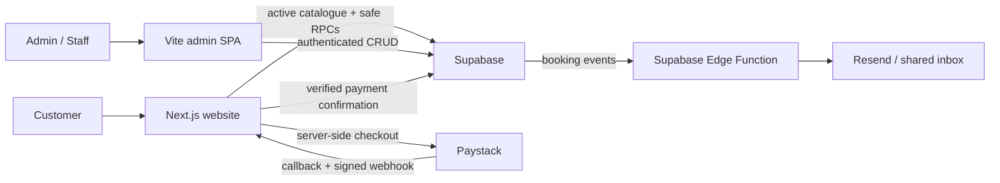
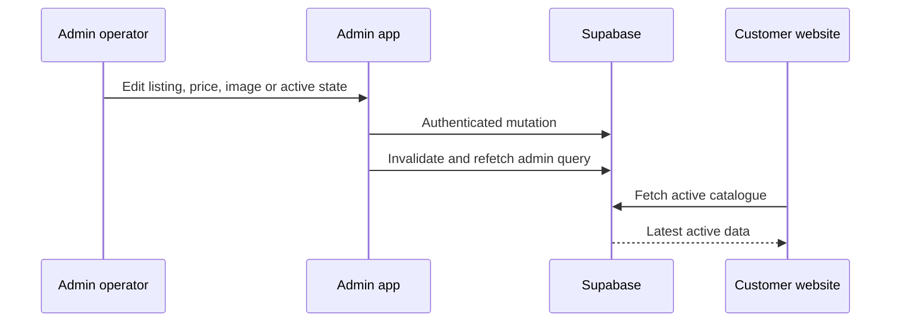
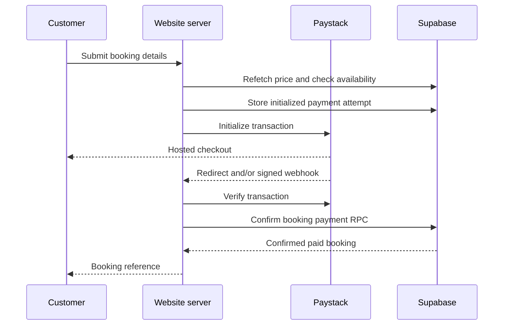

# Gladiator Platform Developer Guide

This guide is for a developer taking over the Gladiator platform. It documents
the admin application, the customer website, their shared Supabase backend, and
the operational side effects that connect them.

Last implementation audit: 5 August 2026.

## 1. System at a glance

Gladiator is two applications backed by one Supabase project:

- `gladiator-admin` (this repository) is a Vite and React single-page app for
  staff operations.
- `../gladiator-website` is a Next.js customer website for browsing inventory,
  checking availability, paying through Paystack, and looking up bookings.
- Supabase owns authentication, PostgreSQL data, row-level security, database
  functions, storage, scheduled booking completion, realtime, and edge
  functions.
- Paystack is called only by server-side website code. A verified payment is
  required before the normal website flow creates a confirmed booking.
- Resend is used by the `notify-new-booking` Supabase Edge Function for the
  shared booking email.



The migrations under `supabase/migrations` are the backend change history for
both applications. Treat the admin repository as the current owner of the
shared database contract.

## 2. Repository map

### Admin application

| Path | Responsibility |
| --- | --- |
| `src/App.tsx` | Routes, providers, lazy-loaded feature pages, metadata |
| `src/context` | Authentication and appearance context |
| `src/features` | Feature pages and React Query mutation/query hooks |
| `src/services` | Supabase reads/writes and shared domain types |
| `src/ui` | Layout, sidebar, header, global search, settings, route guards |
| `src/features/help` | Non-technical in-app operating guide |
| `supabase/migrations` | Shared database evolution and public RPCs |
| `supabase/functions` | Deno Edge Functions for users and booking email |
| `vercel.json` | SPA fallback rewrite for client-side routes |

The normal feature pattern is:

1. A page component renders and coordinates screen state.
2. A `use...` hook wraps `useQuery` or `useMutation`.
3. A service module performs the Supabase operation.
4. A successful mutation invalidates affected React Query keys.
5. Operational mutations may append a row to `notifications` as an activity
   log.

### Customer website

| Path | Responsibility |
| --- | --- |
| `../gladiator-website/src/app` | Next.js routes, payment API routes and verification page |
| `../gladiator-website/src/components/ReservationPlanner` | Public catalogue, quote and checkout form |
| `../gladiator-website/src/components/BookingLookup` | Privacy-limited booking lookup |
| `../gladiator-website/src/services` | Public catalogue RPCs and server payment orchestration |
| `../gladiator-website/src/hooks` | React Query wrappers for the public app |

The website has a browser Supabase client using the publishable key and a
server client using the service-role key. Never import the server client into a
client component or expose `SUPABASE_SERVICE_ROLE_KEY` through a public
environment variable.

## 3. Runtime and commands

The admin package currently requires a Node release supported by Vite 8: Node
20.19+ or 22.12+.

```bash
# Admin
npm install
npm run dev
npm run lint
npm run build

# Customer website
cd ../gladiator-website
npm install
npm run dev
npm run lint
npm run build
```

Admin development defaults to Vite. The website defaults to Next.js on port
3000. Both must point to the same Supabase environment if end-to-end behaviour
is being tested.

### Admin environment

```bash
VITE_SUPABASE_URL=
VITE_SUPABASE_ANON_KEY=
VITE_APP_URL=http://localhost:5173
```

`VITE_APP_URL` is used for invitation/password-reset redirects and canonical
metadata. The current code falls back to a deployed staging URL rather than
localhost, so set it explicitly in local development.

### Website environment

```bash
NEXT_PUBLIC_SUPABASE_URL=
NEXT_PUBLIC_SUPABASE_ANON_KEY=
SUPABASE_SERVICE_ROLE_KEY=
PAYSTACK_SECRET_KEY=
NEXT_PUBLIC_SITE_URL=http://localhost:3000
NEXT_PUBLIC_SUPPORT_WHATSAPP_URL=
NEXT_PUBLIC_SUPPORT_EMAIL=
```

`NEXT_PUBLIC_SITE_URL` supplies Paystack callback and internal verification
URLs. Configure the deployed Paystack webhook to call:

```text
https://<website-domain>/api/paystack/webhook
```

### Edge Function secrets

Supabase supplies its URL and service-role key to Edge Functions. The booking
email function also expects:

```bash
RESEND_API_KEY=
NOTIFY_FROM_EMAIL="Gladiator NG Admin <bookings@example.com>"
```

## 4. Routes and access

### Admin routes

| Route | Feature | Guard |
| --- | --- | --- |
| `/signin` | Sign-in, invite setup, forgotten-password and recovery flows | Public |
| `/dashboard` | Operational and financial overview | Authenticated |
| `/bookings` | Bookings; Customers tab for Admin | Authenticated |
| `/boats` | Boat catalogue and images | Authenticated |
| `/beach-houses` | Property catalogue and images | Authenticated |
| `/locations` | Locations, routes and curfew | Authenticated |
| `/users` | Staff invitations, roles and deletion | Admin UI guard |
| `/profile` | Own name, password and email preference | Authenticated |
| `/help` | Non-technical operating guide | Authenticated |

`ProtectedRoutes` requires a live Supabase session and completed password
setup. `AdminRoute` checks `profiles.role === 'Admin'`. See the security notes
in section 13: most operational RLS policies currently distinguish only
authenticated from anonymous users, so the role is not a complete database
authorization boundary.

### User lifecycle

1. An Admin calls the `create-user` Edge Function.
2. The function validates the caller's profile role using a service-role
   client, sends a Supabase invitation, upserts `profiles`, and creates a
   notification.
3. The invite metadata contains `password_changed: false`.
4. The callback opens `/signin?setup=password`; protected routes remain blocked
   until the invited user sets a password.
5. Normal sign-in updates `profiles.last_logged_in_at` on a best-effort basis.
6. `delete-user` deletes the Auth user and broadcasts `session_revoked`.
7. The admin client validates its session every 15 seconds and on focus, so a
   removed user's local session is cleared promptly.

Admins cannot edit or delete their own row through the Users screen.

## 5. Shared data model

The principal records are:

| Table / resource | Purpose |
| --- | --- |
| `auth.users` | Supabase authentication identity |
| `profiles` | Display name, role and last-login metadata |
| `boats` | Vessel listing, cruise pricing, capacity and rental eligibility |
| `boat_images` | Ordered public boat photos and cover relationship |
| `beach_houses` | Property details, stay pricing, capacity, times and transfer override |
| `beach_house_images` | Ordered public property photos and cover relationship |
| `locations` | Ordered, active/inactive jetties and destinations |
| `transport_routes` | Directional flat route price and one-way duration |
| `customers` | Deduplicated customer record and aggregate statistics |
| `bookings` | Shared operational booking record for all experience types |
| `payment_attempts` | Server-only Paystack attempt, idempotency and reconciliation state |
| `app_settings` | Boat curfew time and enabled flag |
| `notifications` | Shared append-only activity feed |
| `notification_reads` | Per-user read state |
| `notification_preferences` | Per-user feed filters and email preference flag |
| Storage buckets | `boat-images` and `beach-house-images` public media |

Important `bookings` values:

```text
booking_type: boat_cruise | beach_house | boat_rental
beach_house_booking_mode: day_use | overnight
rental_type: outbound | return | round_trip
status: pending | confirmed | cancelled | expired | completed
payment_status: pending | paid | failed
source: admin | web | mobile
```

`parent_beach_house_booking_id` connects a boat rental to a beach-house stay.
`rental_route_id` preserves the selected directional route. Snapshot fields
such as customer name, contact, amount, location and dates remain on the
booking, so later catalogue edits do not rewrite the historical booking.

### Database functions that form public or operational APIs

| Function | Caller | Purpose |
| --- | --- | --- |
| `check_public_availability` | Anonymous and authenticated | Returns only a boolean; does not expose booking rows |
| `submit_public_booking_request` | Anonymous and authenticated | Validates and inserts a pending public booking |
| `confirm_public_booking_payment` | Service role only | Idempotently converts verified payment details into a confirmed, paid booking |
| `lookup_public_booking` | Anonymous and authenticated | Returns a safe booking projection after reference + contact match |
| `auto_complete_bookings` | Cron and admin client | Completes past pending/confirmed bookings |

The database also owns booking reference generation, updated timestamps,
overlap constraints and customer aggregate synchronization.

## 6. Catalogue flow: admin to website

The public website queries only active boats, active beach houses, active
locations, active routes, public images, and the two curfew settings.



Operational consequences:

- `is_active = false` removes an asset from public catalogue reads and makes
  public availability false. Existing bookings are retained.
- `is_available_for_rental = true` is additionally required for a boat to
  appear under public boat transfers.
- Boat transfer selection depends on an active route and an eligible boat. The
  admin form also filters rental boats by the route origin matching the boat's
  pickup location.
- A route is directional. Its unique pair is `from_location_id` plus
  `to_location_id`.
- Images are compressed to WebP at approximately 300 KB maximum before upload.
  Image rows carry `position`; the listing carries `cover_image_id`.
- Public catalogue edits affect future quotes only. A saved booking keeps its
  amount and snapshot fields.

## 7. Booking flows

### Admin-created booking

The admin uses `useCreateBookingForm`, then `createBooking`:

1. The form calculates a suggested total and runs a client availability check.
2. Customer email is normalized and used to find or create a `customers` row.
3. The booking is inserted directly with source `admin`.
4. The database generates its `GLD-...` reference and refreshes customer
   aggregates.
5. React Query invalidates booking, customer and dashboard data.
6. The mutation hook appends relevant activity data to `notifications`.

The availability check and database exclusion constraints are both important.
The client check provides a readable message; the database constraint protects
against races.

### Website checkout

The normal website path is intentionally different:

1. The customer selects an active listing and the browser runs
   `check_public_availability`.
2. `/api/paystack/initialize` receives the proposed booking.
3. Server-side `quoteBooking` refetches current catalogue data, validates
   capacity/duration/availability, and calculates the authoritative price.
4. A normalized request hash is stored in `payment_attempts.request_key` to
   prevent duplicate active checkouts.
5. Paystack receives amount, callback, reference and booking metadata.
6. Paystack redirects to `/payment/verify`; a signed `charge.success` webhook
   can reach the same confirmation path.
7. `verifyAndConfirmPayment` verifies provider status, requested amount,
   currency and metadata.
8. `confirm_public_booking_payment` uses an advisory lock and unique payment
   reference, creates the booking if necessary, checks the database-calculated
   total, then marks it `confirmed` and `paid` with source `web`.
9. Redirect and webhook are safe to repeat: an existing booking is returned.



If provider payment succeeds but validation or booking creation fails,
`payment_attempts.status` becomes `requires_attention`. The customer is told not
to pay again. There is currently no reconciliation UI in the admin application;
maintenance requires server/database access.

### Public booking lookup

`lookup_public_booking` requires both the booking reference and an exact email
or normalized phone match. It returns only the experience, asset label, status,
payment, guests, dates, time, amount and currency. Do not replace it with a
public `select` policy on `bookings`.

## 8. Pricing rules

Current intended formulas are:

```text
Boat cruise
  price_per_hour × hours

Beach house day use
  day_use_price_per_hour × hours
  + extra_guest_fee_per_head × guests above included capacity

Beach house overnight
  price_per_night × nights
  + extra_guest_fee_per_head × guests above included capacity
  + late_checkout_price_per_hour × extension hours (admin-created booking)

Boat rental
  route_price × (2 for round trip, otherwise 1)

Admin linked-stay boat rental
  beach_house.rental_price when set, otherwise route_price
  × trip multiplier
```

`transport_routes.route_price` is a flat route amount, not a per-passenger
amount. Old migration comments and UI copy that say “per person” are stale.

The website server must remain the authority for public quotes. Do not trust
`total_amount` posted by the browser.

## 9. Status, availability and reporting

Only `pending` and `confirmed` bookings block availability. `cancelled`,
`expired`, and `completed` release the time.

The database cron job and `useAutoCompleteBookings` mark past pending or
confirmed rows completed when `end_date < current date`. The client call is the
fallback when pg_cron is unavailable.

Manual booking form behaviour:

- Saving status `pending` derives payment status `pending`.
- Saving another status through the edit/create form derives payment status
  `paid`.
- A confirmed form submission requires a transfer/bank reference.
- Quick status buttons update only `bookings.status`; they leave
  `payment_status` unchanged.

Dedicated revenue cards should use `payment_status = paid`. Current reporting
implementations are not completely uniform; see the audit notes in section 13.

## 10. Notifications and email

`notifications` is both the in-app feed and a lightweight activity log.

- Feed rows are shared among authenticated users.
- `notification_reads` makes read state personal.
- `notification_preferences` filters visible event types per user.
- The admin mutation hooks create actor-attributed events for most changes.
- Database triggers remain for some system-created events such as new
  customers.
- Only the latest 50 feed rows are fetched.

The `email_notifications` preference is stored but the current
`notify-new-booking` Edge Function sends new-booking email to the fixed shared
bookings inbox. It does not fan out to users based on this preference.

## 11. Deploying changes

### Admin and website

Both applications are designed for Vercel. The admin needs the SPA rewrite in
`vercel.json`; the website uses normal Next.js routing.

Before deployment:

1. Run lint and build in each changed application.
2. Confirm environment variables for the target environment.
3. Confirm Supabase Auth redirect URLs contain the deployed admin callback
   URLs used for invites and password reset.
4. Confirm `NEXT_PUBLIC_SITE_URL` matches the deployed customer website.
5. Confirm the Paystack webhook points to the same environment.

### Database

Create a new timestamped migration; do not edit a migration that has already
been applied to a shared environment.

Typical commands are:

```bash
npx --yes supabase@latest migration new <description>
npx --yes supabase@latest db push
```

After changing a PostgREST function signature, drop the old overload when
necessary and notify PostgREST to reload its schema. Check grants explicitly,
especially for `anon`, `authenticated`, and `service_role`.

### Edge Functions

Deploy the changed function and its secrets separately from the web apps.
`create-user`, `list-users`, and `delete-user` perform their own caller/session
and Admin-role checks because their local `verify_jwt` setting may be disabled.

## 12. Verification checklist

For any booking or pricing change, test at least:

- Admin create and edit for all three booking types.
- Day use and overnight stays.
- One-way and round-trip transfers.
- A transfer linked to a beach-house stay.
- A capacity boundary and an extra-guest charge.
- A conflicting pending booking and a non-blocking cancelled booking.
- The one-hour cruise curfew buffer.
- Public quote, Paystack initialization, verification, idempotent re-check, and
  booking lookup.
- Admin and Staff views.
- New-booking notification and shared email.
- Asset active/inactive visibility on the public site.

For payment tests, use the provider's test environment and a non-production
Supabase project. Never replay a real payment reference into another
environment.

## 13. Audited implementation risks and takeover notes

These are current implementation facts, not hypothetical best practices.

### High: Staff role is mainly enforced in the UI

The Users Edge Functions validate Admin role, but the original operational RLS
policies generally allow any authenticated user to read and mutate boats,
bookings, customers, locations and routes. Hiding Admin financial/customer UI
does not prevent a direct authenticated API call. Add database policies that
enforce the role before treating Admin and Staff as a security boundary.

### High: anonymous pending-booking RPC can bypass payment

`submit_public_booking_request` is granted to `anon` because the payment
confirmation function calls it internally, but it is also directly callable by
an anonymous client and inserts a pending booking that blocks availability.
The normal website uses the Paystack flow, but a caller can bypass it. Refactor
the insertion helper into a service-role-only function; expose only the boolean
availability check and server checkout route publicly.

### High: linked-transfer quote can disagree with database total

The website server quotes `transport_routes.route_price`, while the public
booking RPC may replace that value with `beach_houses.rental_price` for a linked
stay. If the override differs, payment succeeds but confirmation raises “price
changed” and the attempt needs manual attention. Use the same authoritative
quote function for initialization and confirmation.

### High: fresh database bootstrap is not fully represented

This repository contains migrations for boats and bookings plus later changes,
but the initial creation of `profiles`, `beach_houses`,
`beach_house_images`, and `app_settings` is not present. A new Supabase project
cannot be reproduced solely from this migration directory. Capture the live
schema in additive baseline migrations after reviewing production drift.

### Medium: admin and website guest-count semantics differ

The public website treats `guest_count` as total guests. The admin form labels
the entry as additional guests including an implied lead customer for pricing,
but stores the raw form value (with zero falling back to one). Capacity,
reporting, and extra-guest charges can disagree between sources. Standardize
the field as total guests end-to-end.

### Medium: some charts use booking value rather than paid revenue

Dashboard all-time/monthly revenue uses paid, non-cancelled bookings. The
“Revenue by Booking Type” and asset-performance aggregations currently sum all
non-cancelled booking totals, including unpaid rows. Keep the current user help
wording or align those queries before labelling them paid revenue.

### Medium: booking email trigger and Edge Function payloads need alignment

The latest `notify_new_booking` SQL function posts `row_to_json(new)`, while the
Edge Function currently expects a database-webhook envelope with `type`,
`table`, and `record`. Its links also contain a hard-coded admin domain and the
SQL contains a hard-coded Supabase project reference. Verify the live trigger,
standardize the payload, and move environment-specific URLs into configuration.

### Medium: payment reconciliation has no admin screen

`payment_attempts` correctly records initialized, paid, confirmed and
requires-attention states, but operations cannot view or reconcile them in the
admin app. Add a restricted Admin-only reconciliation view before relying on
non-developers to resolve payment edge cases.

### Low: naming is historically inconsistent

The domain value `boat_rental` is variously described as Boat Rental,
Transport, Boat Transfer, and rental. The Locations page still labels the
cruise curfew tab “Transport Curfew.” Prefer customer-facing “Boat transfer”
and internal `boat_rental`, and clean up stale comments and copy gradually.

## 14. Safe first steps for a new maintainer

1. Obtain access to the two repositories, Vercel projects, Supabase project,
   Paystack dashboard, Resend account, DNS, and the shared bookings inbox.
2. Document environment ownership and rotate secrets if ownership changed.
3. Export and compare the live Supabase schema with this migration history.
4. Run both applications locally against a non-production project.
5. Resolve the high-risk items above before adding another booking channel.
6. Add automated tests around quoting, availability, payment idempotency, role
   enforcement, and migration bootstrap.
7. Keep `src/features/help/HelpPage.tsx` and this guide in the definition of
   done for any workflow, pricing, role, or website integration change.
